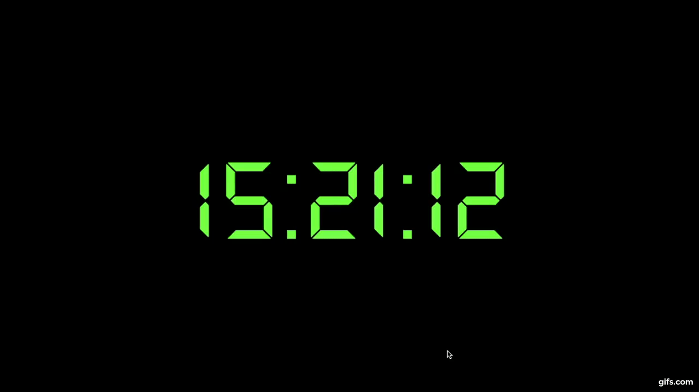

# Digital clock

JavaScript date reference
Date object is used to work with dates and times.

View:

[ https://victoriasimao.github.io/DigitalClock/](https://victoriasimao.github.io/DigitalClock/)
> Victoria Simao